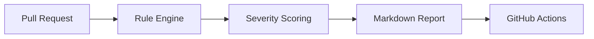

# AIPowered-RuleBased-PR-Review

[](https://github.com)
[](LICENSE)
[](https://www.typescriptlang.org/)

AI-powered and rule-based Pull Request review for Playwright TypeScript automation repositories. The system combines a fast static rule engine with optional OpenAI-assisted review to generate actionable comments before code reaches production.

## Features

- Rule-based review for Playwright and TypeScript best practices
- Optional AI review using OpenAI GPT
- GitHub Actions workflow for pull request automation
- Markdown review report generation
- Enterprise-friendly configuration via environment variables
- Modular architecture for reuse across many repositories

## Project Structure

- src/ - core review engine and types
- tests/ - unit tests for rule detection
- docs/ - architecture, setup, and usage guidance
- .github/workflows/ - GitHub Actions automation

## Quick Start

1. Install dependencies
   ```bash
   npm install
   ```
2. Copy the environment file
   ```bash
   copy .env.example .env
   ```
3. Run the review engine
   ```bash
   npm run review
   ```
4. Run tests
   ```bash
   npm test
   ```

## Architecture



## Configuration

Configuration is driven through environment variables in .env. Key settings include:

- OPENAI_API_KEY
- OPENAI_MODEL
- GITHUB_TOKEN
- GITHUB_REPOSITORY
- MAX_FILES
- MAX_COMMENTS
- CHUNK_SIZE

## Documentation

- [docs/architecture.md](docs/architecture.md)
- [docs/setup-guide.md](docs/setup-guide.md)
- [docs/configuration-guide.md](docs/configuration-guide.md)
- [docs/developer-guide.md](docs/developer-guide.md)
- [docs/troubleshooting.md](docs/troubleshooting.md)
- [docs/faq.md](docs/faq.md)

## License

MIT
